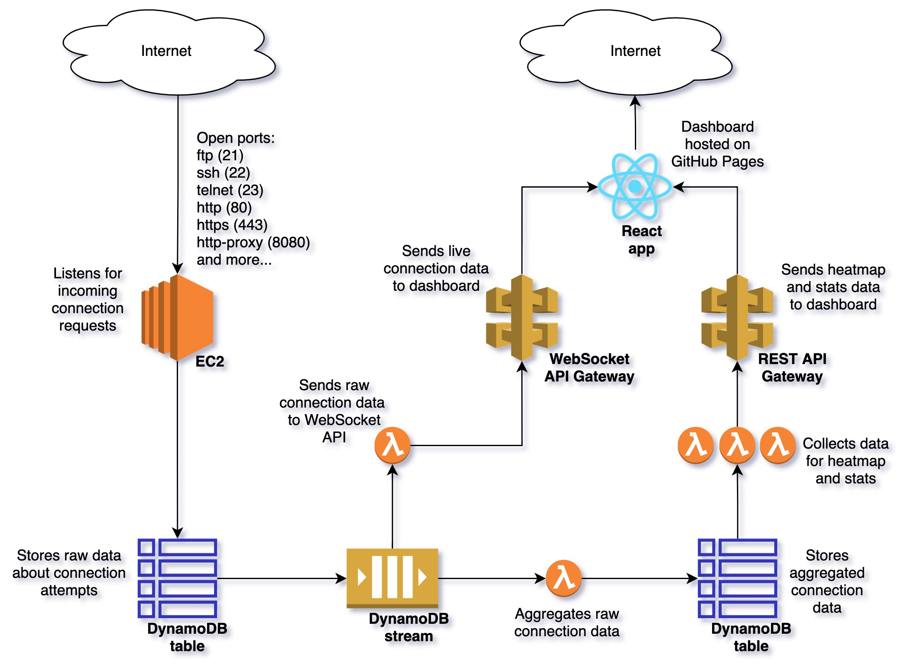

# honey-badger
Honey Badger is a honeypot application that logs and analyses connection attempts to an open server.
It is built on AWS and is accessible through a React dashboard hosted on GitHub Pages:

[https://bm402.github.io/honey-badger/](https://bm402.github.io/honey-badger/)

## Architecture
The application architecture is made up of lots of different AWS components. These components are provisioned using the AWS Cloud Development Kit (CDK) which provides the consistency and replicability of the cloud resources that it uses. An overview of the architecture is shown below.

---



---

### Listeners
The listeners are lightweight Go applications that run continuously in an EC2 instance. They listen for any connection attempts on several commonly used ports and log the connection attempt data (including IP address, location and payload) to the Raw Logs DynamoDB table.

### Aggregator
When a log is written to the Raw Logs table, a DynamoDB stream triggers the aggregator Lambda function. The aggregator function groups the logs based on location, which makes it easier to analyse how many connections are being attempted by a particular host. The aggregated logs are maintained in the Aggregated Logs DynamoDB table.

### REST API
The REST API serves data from the Aggregated Logs table using a number of Lambda functions to transform the data into the necessary format to visualise the data in different ways. This includes aggregated location data to form a heatmap of connection attempts from around the world, and some aggregated statistics to show the most persistent hosts.

### WebSocket API
The WebSocket API provides real time connection attempt data. When a log is written to the Raw Logs table, a DynamoDB stream triggers the broadcaster Lambda function which sends details of the log to any active WebSocket connections that the API is maintaining.

### Dashboard
The dashboard is a React application that consumes both the REST API and the WebSocket API to visualise the connection attempt data in different ways, including a heatmap, stats and live logs.

## Usage
This project is fully replicable by design using the AWS CDK and GitHub Pages.

### Prerequisites
- AWS CLI
- AWS CDK
- Node.js
- Typescript
- Go
- Docker

### Setup
In `scripts/listener-instance-user-data.sh`, change the following line to the Git repo you are using.
```
git clone https://github.com/bm402/honey-badger.git
```

In `dashboard/package.json`, change the following line to the GitHub Pages link your project is using.
```
"homepage": "http://bm402.github.io/honey-badger"
```

Configure your AWS credentials by running the following command in a terminal and following the prompts.
```
$ aws configure
```

### Usage
Ensure that Docker is running, and then run the following commands at the root of the project to provision and launch the AWS architecture.
```
$ npm install
$ cdk synth
$ cdk deploy
```

Publish the React dashboard to GitHub pages by running the following commands.
```
$ cd dashboard
$ npm install
$ npm run deploy
```

## Potential improvements
- Large CloudFormation stack could be split into different stacks for each layer of the application
- More diverse statistics could be added, eg. most targetted port
- Unit testing for most elements of the project is sparse to say the least
